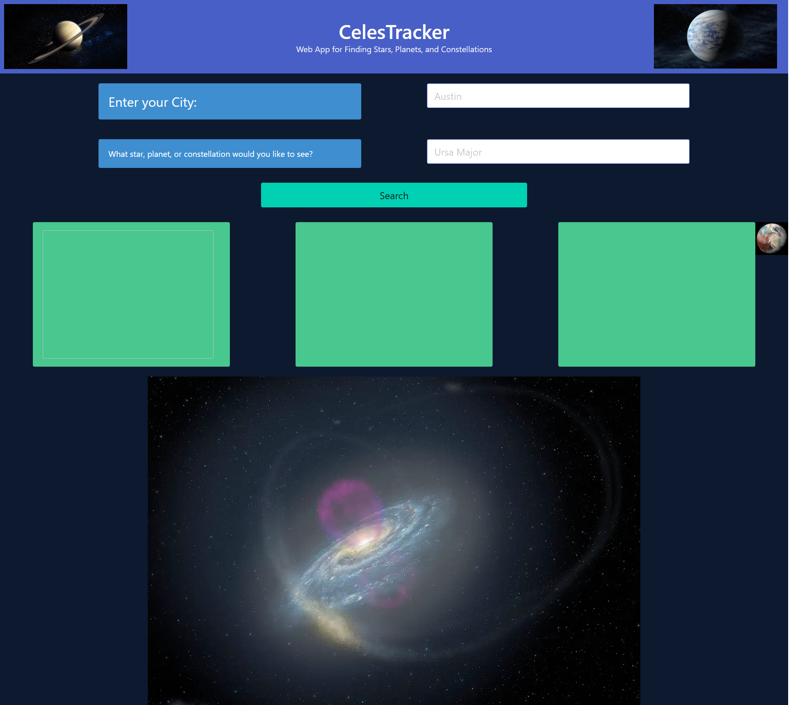

# Star, Planet, and Constellation Tracker

## Description
The Star/Planet/Constellation Tracker will essentially allow the user to submit location information and name(s) of stars/planets/constellations that they want to see from said location.  API returns information about what days/weeks are the best times (if any) to be able to see said stars/planets/constellations. 
 

## Usage
The Star/Constellation tracker can be accessed through here: 
https://jmcmillenmusic.github.io/project-1/

## Credits
All websites, documentation, and APIs utilized in our star/constellation tracker will be listed here: 
Bulma css framework: https://bulma.io/documentation/overview/
NASA API: https://api.nasa.gov/
Weather API: https://www.weatherapi.com/my/
Wikipedia API: https://www.mediawiki.org/wiki/API:Main_page
Astronomy API: https://astronomyapi.com/
These individuals each contributed to the webpage's overall functionality in regards to all various files being able to coincide with each other as various commits made to the code/files: 
Jeff McMillen: https://github.com/jmcmillenmusic
Caleb Covin: https://github.com/CCovin1
Daniel Lee: https://github.com/drog41813
Skylar Hammond: https://github.com/SkylarHammond55
Alex Green: https://github.com/AlexGreen0517

## License
MIT License

Copyright (c) 2023 jmcmillenmusic

Permission is hereby granted, free of charge, to any person obtaining a copy
of this software and associated documentation files (the "Software"), to deal
in the Software without restriction, including without limitation the rights
to use, copy, modify, merge, publish, distribute, sublicense, and/or sell
copies of the Software, and to permit persons to whom the Software is
furnished to do so, subject to the following conditions:

The above copyright notice and this permission notice shall be included in all
copies or substantial portions of the Software.

THE SOFTWARE IS PROVIDED "AS IS", WITHOUT WARRANTY OF ANY KIND, EXPRESS OR
IMPLIED, INCLUDING BUT NOT LIMITED TO THE WARRANTIES OF MERCHANTABILITY,
FITNESS FOR A PARTICULAR PURPOSE AND NONINFRINGEMENT. IN NO EVENT SHALL THE
AUTHORS OR COPYRIGHT HOLDERS BE LIABLE FOR ANY CLAIM, DAMAGES OR OTHER
LIABILITY, WHETHER IN AN ACTION OF CONTRACT, TORT OR OTHERWISE, ARISING FROM,
OUT OF OR IN CONNECTION WITH THE SOFTWARE OR THE USE OR OTHER DEALINGS IN THE
SOFTWARE.